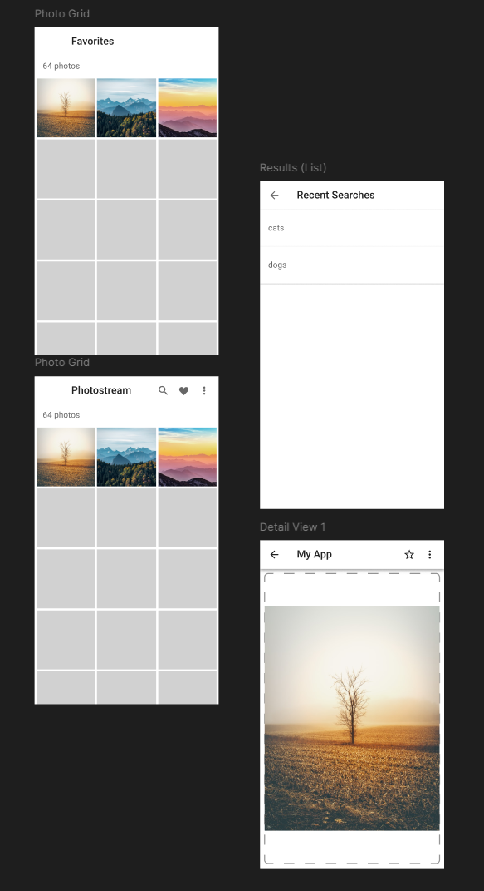
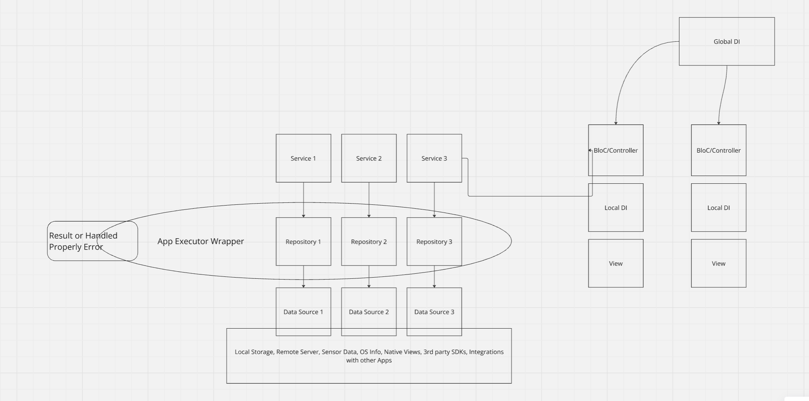

# image_client

A new Flutter project for consuming images and marking them as favorites.

As Source the project uses pixabay.

## Getting Started

1. After downloading the project - set your key from https://pixabay.com/api/docs/ to the env.dart
2. Execute - dart run build_runner build
3. Run the App

## App UI

The App consists of:

- Home Screen - with the feature to search, go to favorites, go to details on image tab
- Favorites Screen - very similar to Home with focus on fav images
- Details Screen - Bigger view and more details about the image. Feature - add/remove from fav.
- (TODO) Recent Searches

## App Architecture

The app's code is organized in layers 

- Data Access
- Repositories
- Services
- BloCs
- Local DIs for Blocs
- Views
- Global DI
- Routing
- (TODO) I18n